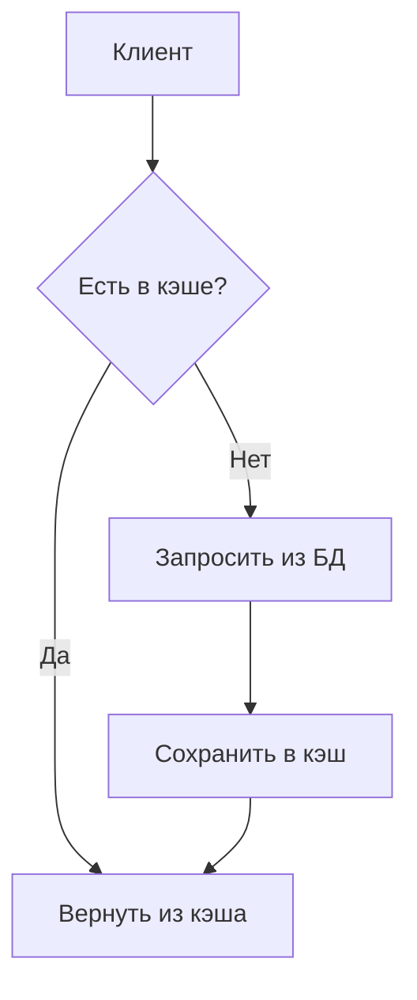

## 1. Основные понятия
**Кеширование** — сохранение данных в быстром хранилище для:
- Ускорения доступа
- Снижения нагрузки на БД
- Повторного использования вычисленных данных

**Проблемы без кеширования**:
- Высокая нагрузка на БД
- Медленные ответы API
- Повторные вычисления одинаковых данных

## 2. Типы кеширования

### 2.1 In-Memory Cache
**Для чего**: Быстрый доступ к данным в рамках одного сервера

```csharp
// Startup
services.AddMemoryCache(options => 
{
    options.SizeLimit = 1024; // Лимит в "условных единицах"
});

// Использование
public Product GetProduct(int id)
{
    return _cache.GetOrCreate($"product_{id}", entry =>
    {
        entry.AbsoluteExpiration = DateTimeOffset.Now.AddHours(1);
        entry.SlidingExpiration = TimeSpan.FromMinutes(20);
        return _db.Products.Find(id);
    });
}
```

**Плюсы**:
- Максимальная скорость
- Простая реализация

**Минусы**:
- Не распределяется между серверами
- Теряется при перезапуске приложения

### 2.2 Распределенный кэш (Redis)
**Для чего**: Общий кэш для кластера серверов

```csharp
// Подключение
services.AddStackExchangeRedisCache(options =>
{
    options.Configuration = "localhost:6379";
    options.InstanceName = "MyApp_";
});

// Использование
public async Task<Product> GetProductAsync(int id)
{
    var key = $"product_{id}";
    var product = await _cache.GetStringAsync(key);
    
    if (product == null)
    {
        product = JsonSerializer.Serialize(_db.Products.Find(id));
        await _cache.SetStringAsync(key, product, new DistributedCacheEntryOptions
        {
            AbsoluteExpirationRelativeToNow = TimeSpan.FromDays(1)
        });
    }
    
    return JsonSerializer.Deserialize<Product>(product);
}
```

**Альтернативы Redis**:
- NCache
- SQL Server Distributed Cache
- Memcached

### 2.3 Response Caching
**Для чего**: Кэширование HTTP-ответов

```csharp
// Startup
services.AddResponseCaching();
app.UseResponseCaching();

// Контроллер
[HttpGet]
[ResponseCache(Duration = 60, VaryByQueryKeys = new[] {"id"})]
public IActionResult GetProduct(int id)
{
    return Ok(_db.Products.Find(id));
}
```

**Заголовки**:
- `Cache-Control: public,max-age=60`
- `Vary: Accept-Encoding`

### 2.4 Tag Helper Caching
**Для чего**: Кэширование частей Razor-страниц

```html
<!-- Кэшировать на 1 час -->
<cache expires-after="@TimeSpan.FromHours(1)">
    @DateTime.Now.ToLongTimeString()
</cache>

<!-- Кэшировать отдельно для каждого пользователя -->
<cache vary-by="@User.Id">
    Персональные данные для @User.Name
</cache>
```

## 3. Сравнение методов

| Критерий            | In-Memory | Redis  | Response | Tag Helper |
|---------------------|----------|--------|----------|------------|
| Скорость           | ⚡️ Быстрее всего | 🏎️ Быстро | 🚗 Средне | 🚗 Средне |
| Распределенность   | ❌ Нет    | ✅ Да   | ❌ Нет    | ❌ Нет     |
| Сложность          | Низкая   | Высокая | Средняя  | Низкая     |
| Подходит для       | Данные одного сервера | Кластеры | API ответы | Части страниц |

## 4. Лучшие практики

### Общие правила
- Всегда устанавливайте **лимиты** и **время жизни**
- Реализуйте **инвалидацию** при изменении данных
- Мониторьте **hit/miss ratio**

### Для In-Memory
```csharp
// Удаление кэша
_cache.Remove("my_key");

// Комбинирование Absolute+Sliding
entry.AbsoluteExpirationRelativeToNow = TimeSpan.FromHours(1);
entry.SlidingExpiration = TimeSpan.FromMinutes(15);
```

### Для Redis
```csharp
// Политики повторных попыток
options.ConfigurationOptions = new ConfigurationOptions
{
    ConnectRetry = 5,
    ReconnectRetryPolicy = new LinearRetry(1000)
};
```

### Для Response Cache
```csharp
// Отключение кэширования
[ResponseCache(NoStore = true)]
public IActionResult GetSensitiveData()
```

## 5. Антипаттерны
- Кэширование **слишком больших** объектов
- Отсутствие **инвалидации** после обновлений
- Кэширование **персональных данных** без маркировки
- Использование **одного ключа** для разных данных

## 6. Мониторинг
**Метрики для отслеживания**:
- Размер кэша
- Hit/Miss ratio
- Время загрузки из кэша
- Частота инвалидации

**Инструменты**:
- Application Insights
- Prometheus + Grafana
- RedisInsight для Redis

## 7. Полезные ссылки
- [Документация Microsoft](https://learn.microsoft.com/aspnet/core/performance/caching)
- [Redis Best Practices](https://redis.io/docs/management/best-practices/)
- [Книга "Caching in .NET"](https://www.manning.com/books/caching-in-dot-net)
````

**Особенности для Obsidian**:
1. Используйте плагин `Dataview` для таблиц
2. Добавьте теги типа `#dotnet` и `#caching`
3. Свяжите с другими заметками через `[[ ]]`
4. Для схем используйте Mermaid-диаграммы:


