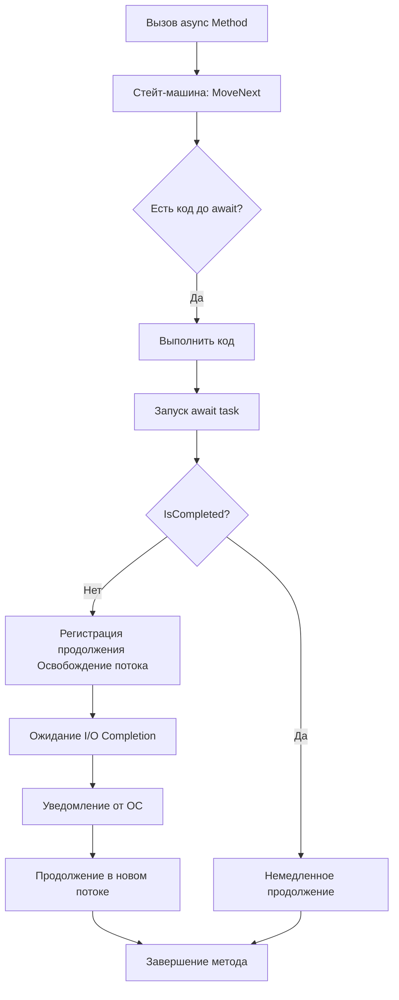

# 🧵 Многопоточность, Параллельность, Асинхронность

> [!summary]  
Эти три понятия — **многопоточность**, **асинхронность** и **параллелизм** — часто путают.  
Каждое из них решает задачи повышения производительности приложения, но делает это по-разному.  
Понимание разницы между ними поможет писать более эффективный и надёжный код, особенно на .NET.

---

## 🔍 Что есть что?

| Термин           | Описание |
|------------------|----------|
| **Однопоточность** | Выполнение всех задач в одном потоке поочерёдно |
| **Асинхронность** | Выполнение задач без блокировки вызывающего потока (например, сетевые или дисковые операции) |
| **Многопоточность** | Использование нескольких потоков внутри одного процесса для ускорения выполнения |
| **Параллелизм** | Физически одновременное выполнение задач на разных ядрах процессора |

### Где происходит параллелизм?

|Уровень|Примеры|
|---|---|
|**Один процесс, несколько потоков**|Многопоточные приложения, где разные потоки работают параллельно на разных ядрах|
|**Несколько процессов**|Разные программы или экземпляры одной программы, работающие одновременно|
|**Распределённые системы**|Сервисы на разных серверах, выполняющие задачи одновременно|

---

## 🧱 Процесс и Поток

### **Процесс**
- Это экземпляр запущенной программы.
- Имеет собственное виртуальное адресное пространство.
- Изолирован от других процессов.

### **Поток**
- Наименьшая единица планирования в системе.
- Принадлежит своему процессу и разделяет его ресурсы.
- Каждый процесс имеет как минимум один поток.

---

### 💡 Процесс vs Поток

| Характеристика   | Процесс                           | Поток (Thread)                      |
| ---------------- | --------------------------------- | ----------------------------------- |
| **Изоляция**     | Полная (своя память)              | Разделяет память процесса           |
| **Создание**     | Тяжелее (нужна отдельная среда)   | Легче (использует ресурсы процесса) |
| **Переключение** | Медленнее                         | Быстрее                             |
| **Надёжность**   | Безопаснее                        | Ошибка может убить весь процесс     |

---

## 🤔 В чём разница между асинхронностью и многопоточностью?

**Асинхронность** не всегда означает использование нескольких потоков. Например, JavaScript — однопоточный язык, но использует **event loop** и умеет выполнять асинхронные операции без блокировки основного потока.

> ✅ **Пример:**  
```csharp
await httpClient.GetAsync("https://example.com"); // Не занимает поток во время ожидания
```

---

## ⚙️ async/await и Task

### Пример:
```csharp
public async Task GetData()
{
    var data = await repository.GetDataAsync();
    Console.WriteLine(data);
}
```

### Почему нельзя использовать `void` вместо `Task`?
1. ❌ Невозможно дождаться завершения метода
2. ❌ Исключения "пропадают" и не обрабатываются корректно
3. ❌ Нет возможности использовать `await` внутри

> [!warning]  
Используйте только `async Task` или `async Task<T>` в API

---

## 🔄 Под капотом async/await

Компилятор преобразует `async` методы в **state machine**, которая управляет состояниями:
- Запущено
- Приостановлено
- Возобновлено
- Завершено
- Ошибка / Отменено

1. **Запущено** (`state = -1`)
    - Начало выполнения метода
2. **Приостановлено**
    - При встрече `await`, если операция не завершена
3. **Возобновлено**
    - Через callback при завершении IO
4. **Завершено**
    - Успешное выполнение (`SetResult`)
5. **Ошибка/Отмена**
    - Исключение или cancellation (`SetException`)

---

## ⚙️ Механизм работы CLR

> 📌 **I/O Completion Ports (IOCP)** — ключевой механизм уведомлений:
- При IO операциях (сеть, файлы) регистрируется callback
- Драйвер устройства сигнализирует о завершении
- Пул потоков получает уведомление через IOCP
- Вызывается продолжение (continuation)

---

## 🧩 Компоненты системы

| Компонент             | Назначение |
|-----------------------|------------|
| `MoveNext()`          | Главный метод выполнения |
| `Awaiter`             | Контроль завершения операции |
| `AsyncMethodBuilder`  | Управление Task |
| `ExecutionContext`    | Сохранение контекста |

---

## # Под капотом async/await в C#

```csharp
[CompilerGenerated]
class AsyncStateMachine : IAsyncStateMachine
{
    int state;          // Текущее состояние
    AsyncTaskMethodBuilder builder;  // Построитель задачи
    TaskAwaiter awaiter; // Ожидатель
    void MoveNext()     // Главный метод выполнения
    {
        // Логика разделенная по await
    }
}
```

> 🛠 CLR получает уведомление через **I/O Completion Ports**, когда задача завершена.

---

### **Зачем нужен `GetAwaiter()` в C# async/await?**

`GetAwaiter()` — это ключевая часть механизма `await`, которая позволяет:
1. **Проверить, завершена ли операция** (`IsCompleted`)
2. **Подписаться на уведомление о завершении** (`OnCompleted`)
3. **Получить результат или исключение** (`GetResult()`)

---

### 🔹 Зачем это нужно? Без `GetAwaiter()`...
- ❌ Нельзя было бы `await`ить ничего, кроме `Task`/`ValueTask`.
- ❌ Не было бы гибкости (например, `await` для `YieldAwaitable` в `Task.Yield()`).
- ❌ Пришлось бы блокировать поток для получения результата (как в `.Result` или `.Wait()`)

---

## 🧠 ThreadPool

CLR автоматически управляет **пулом потоков**, чтобы избежать накладных расходов при частом создании потоков.

### Минусы ручного создания потоков:
- Дорогостоящая операция
- Может быть медленнее самой задачи

> ⚠️ Рекомендация: используйте `Task`, `Parallel`, `async/await` вместо `new Thread()`.

---

## 🤖 Создание потоков

```csharp
Thread thread = new Thread(() => Console.WriteLine("Hello from thread"));
thread.Start();
```

### Когда использовать `Thread` вместо пула потоков?
- Нужен поток с **нестандартным приоритетом**
	- **Зачем?** Например, для аудио/видео обработки, где задержки недопустимы.
	```csharp
	var thread = new Thread(ProcessAudio)
	{
	    Priority = ThreadPriority.Highest // Приоритет выше обычного
	};
	thread.Start();
	void ProcessAudio()
	{
	    // Критичный код (например, декодирование звука)
	}
	```
- Нужен **долгоживущий поток**
	- **Зачем?** Для фоновых задач, которые работают всё время (например, мониторинг).
	```csharp
	var longRunningThread = new Thread(MonitorQueue)
	{
	    IsBackground = false // Не завершится при закрытии приложения
	};
	longRunningThread.Start();
	void MonitorQueue()
	{
	    while (true)
	    {
	        // Проверяем очередь сообщений...
	        Thread.Sleep(1000);
	    }
	}
	```

**Пример в реальности:**
- **Серверные приложения** (например, обработчик запросов в Redis).
- Нужно создать **активный поток**
	- **Зачем?** Когда нужно явно контролировать выполнение (например, пул потоков).
	```csharp
	var activeThread = new Thread(Work);
	activeThread.Start();
	void Work()
	{
		while (!isTerminated)
		{
			// Работает, пока не скажут остановиться
			if (hasTask) ExecuteTask();
			else Thread.Sleep(10);
		}
	}
	```
> 💡 Пример: сборщик мусора работает в высокоприоритетном потоке

---

## 🧩 ValueTask

```csharp
public ValueTask<int> GetValueAsync()
{
    if (_cache.HasValue)
        return new ValueTask<int>(_cache.Value);
    else
        return new ValueTask<int>(LoadFromDbAsync());
}
```

> ✅ Используется, если результат часто уже готов (например, из кэша)

---

## 🧱 Parallel и PLINQ

```csharp
Parallel.For(0, 100, i => Process(i));
var result = numbers.AsParallel().Where(n => n > 10).ToList();
```

> ⚠️ Избегай `Parallel` в ASP.NET — легко исчерпать пул потоков

---

## 📊 Concurrent Collections

**Concurrent Collections** — это набор потокобезопасных коллекций из пространства имён `System.Collections.Concurrent`.  
Они специально разработаны для работы в многопоточной среде, чтобы избежать гонки данных и обеспечить безопасное чтение/запись без явной синхронизации.

### 🔧 Основные типы:

| Коллекция                  | Назначение |
|----------------------------|------------|
| **`ConcurrentBag<T>`**     | Неупорядоченная коллекция, оптимизированная под параллельную вставку и чтение. |
| **`ConcurrentQueue<T>`**   | FIFO очередь |
| **`ConcurrentStack<T>`**   | LIFO стек |
| **`ConcurrentDictionary<TKey, TValue>`** | Потокобезопасный словарь |
| **`BlockingCollection<T>`** | Обертка с возможностью блокировки при переполнении или пустом состоянии |

---

### 📈 Producer-Consumer модель с BlockingCollection

```csharp
var collection = new BlockingCollection<string>(boundedCapacity: 5);
// Producer
Task.Run(() =>
{
    for (int i = 0; i < 10; i++)
    {
        collection.Add($"Item {i}");
        Console.WriteLine($"Produced: Item {i}");
        Thread.Sleep(100);
    }
    collection.CompleteAdding();
});
// Consumer
foreach (var item in collection.GetConsumingEnumerable())
{
    Console.WriteLine($"Consumed: {item}");
}
```

#### 🧭 Диаграмма Producer-Consumer:
```
Producer → [BlockingCollection] ← Consumer
```

---

### 🧰 Какую коллекцию выбрать? (Шпаргалка)

| Сценарий | Рекомендуемая коллекция | Почему |
|---------|--------------------------|--------|
| Хранение данных с быстрым доступом по ключу | `ConcurrentDictionary<TKey, TValue>` | Атомарные операции, потокобезопасность |
| Обработка задач в порядке очереди | `ConcurrentQueue<T>` | FIFO, легковесна |
| Последнее добавленное — первым обработано | `ConcurrentStack<T>` | LIFO |
| Нужно собрать данные из нескольких потоков | `ConcurrentBag<T>` | Минимальные блокировки |
| Producer-consumer модель | `BlockingCollection<T>` | Блокировка при переполнении / пустом состоянии |

---

## 🧬 Partitioner и PLINQ

### 🧱 Partitioner

Используется для оптимизации параллельных вычислений в `Parallel.ForEach`.

```csharp
var partitioner = Partitioner.Create(0, 1000);
Parallel.ForEach(partitioner, range =>
{
    for (int i = range.Item1; i < range.Item2; i++)
    {
        Process(i);
    }
});
```

### 🧮 PLINQ (Parallel LINQ)

Работает как обычный LINQ, но выполняет запросы параллельно.

```csharp
var result = numbers.AsParallel()
                    .Where(n => n % 2 == 0)
                    .OrderBy(n => n)
                    .ToList();
```

> ⚠️ PLINQ хорош для CPU-bound задач, но не для IO-bound

---

## 🧪 Race Condition (гонка данных)

Если несколько потоков обращаются к общему ресурсу без синхронизации, результат зависит от порядка их работы.

### Пример:
```csharp
int counter = 0;
for (int i = 0; i < 1000; i++)
{
    new Thread(() => counter++).Start();
}
```

> ⚠️ Результат **не гарантированно равен 1000**

---

## 🧰 Примитивы синхронизации

| Примитив         | Назначение |
|------------------|------------|
| `lock`           | Блокировка участка кода |
| `Monitor`        | Расширенный `lock` |
| `Mutex`          | Межпроцессная синхронизация |
| `Semaphore`      | Контроль доступа к ресурсу несколькими потоками |
| `SemaphoreSlim`  | Легковесная версия `Semaphore` |
| `Interlocked`    | Атомарные операции над переменными |
| `Volatile`       | Чтение актуальных значений из памяти |

### Пример lock:
```csharp
private static readonly object _lock = new();
lock (_lock)
{
    counter++;
}
```

> ⚠️ `lock` не поддерживает `await`. Для асинхронной синхронизации используй `SemaphoreSlim`.

---

## 🧠 Теория

### Однопоточность

Один поток обрабатывает все задачи поочерёдно.

### Асинхронность

Не блокирует поток при длительных операциях (сетевые запросы, БД), освобождает его для других задач.

### Многопоточность

Работа с несколькими потоками для повышения производительности. Требует синхронизации.

### Параллелизм

Физическое одновременное выполнение задач на разных ядрах.

---

## ⚠️ Частые ошибки

| Ошибка | Почему плохо |
|-------|--------------|
| `.Result` или `.Wait()` в ASP.NET | Может вызвать deadlock |
| Неправильное использование `ConfigureAwait(true)` | Может привести к блокировке контекста UI или ASP.NET |
| Использование `lock` в асинхронном коде | Несовместимо |
| Неправильная синхронизация | Гонка данных, нестабильная логика |

---

## 📝 FAQ

### Q: Почему нельзя использовать `lock` с `await`?
A: `lock` блокирует поток, а `await` может продолжиться в другом потоке → возможна **deadlock** или **повторная блокировка**.

### Q: Что такое `volatile`?
A: Переменная помечается как `volatile`, чтобы всегда читалось актуальное значение из памяти, а не из регистров или кэша.

### Q: Что делает `Interlocked`?
A: Предоставляет атомарные операции (`Increment`, `Add`, `CompareExchange`) для безопасной работы с переменными в многопоточной среде.

---

## 📚 Полезные ссылки

- [Microsoft Docs: async/await](https://docs.microsoft.com/en-us/dotnet/csharp/async)
- [Stephen Cleary — Don't Block on Async Code](https://blog.stephencleary.com/2012/07/dont-block-on-async-code.html)
- [TPL Documentation](https://docs.microsoft.com/en-us/dotnet/standard/parallel-programming/task-parallel-library-tpl)
- [ConfigureAwait FAQ](https://devblogs.microsoft.com/dotnet/configureawait-faq/)

## 📄 Жизненный цикл async-метода (под капотом)

1. async Task Method()
   - Компилятор преобразует метод в state machine
2. MoveNext()
   - Выполняет синхронную часть кода до первого `await`
3. Проверка IsCompleted
   - Если задача уже завершена:
     - Переход к следующей части метода
   - Если не завершена:
4. await task.GetAwaiter().OnCompleted(...)
   - Регистрация continuation (продолжения)
5. Поток освобождается в пул
6. ОС завершает операцию (например, I/O)
7. ОС сигнализирует CLR через I/O Completion Port
8. CLR вызывает MoveNext()
9. Продолжение метода после await

---

## 🔄 Диаграмма жизненного цикла async-метода



---

## 💡 Дополнительно: Пример использования `BlockingCollection<T>` (Producer-Consumer)

```csharp
var collection = new BlockingCollection<int>(boundedCapacity: 5);
// Producer
Task.Run(() =>
{
    for (int i = 0; i < 10; i++)
    {
        collection.Add(i);
        Console.WriteLine($"Produced: {i}");
        Thread.Sleep(100);
    }
    collection.CompleteAdding();
});
// Consumer
foreach (var item in collection.GetConsumingEnumerable())
{
    Console.WriteLine($"Consumed: {item}");
}
```

---

# 📄 Карточка-таблица: Вопросы и ответы на собеседовании

| ❓ Вопрос | ✅ Ответ |
|----------|----------|
| Что такое процесс и поток? | Процесс — это изолированная программа с выделенными ресурсами. Поток — минимальная единица выполнения внутри процесса, разделяющая ресурсы своего процесса. |
| В чём разница между процессом и потоком? | Процесс имеет собственное адресное пространство памяти (изолирован), потоки одного процесса делят память. Создание процесса дороже, чем потока. |
| Что такое многопоточность? | Это возможность выполнять несколько потоков одновременно внутри одного процесса. Используется для повышения производительности и отзывчивости приложения. |
| Что такое параллелизм? | Физически одновременное выполнение задач на разных ядрах процессора. Требует нескольких потоков. |
| В чём разница между асинхронностью и многопоточностью? | Асинхронность позволяет не блокировать поток во время ожидания (например, IO), многопоточность использует несколько потоков для выполнения задач. Асинхронность может работать без многопоточности (пример: JS event loop). |
| Что такое `async/await` и как это работает под капотом? | Это синтаксический сахар, преобразующий метод в state machine. Компилятор генерирует класс, управляющий состояниями: начальное, приостановленное, возобновлённое, завершённое, ошибка, отменено. |
| Почему нельзя использовать `void` вместо `Task` в асинхронных методах? | Невозможно отследить завершение или обработать исключения. Исключение "пропадает" и не пробрасывается в вызывающий код. |
| Что такое `ValueTask` и когда его использовать? | Легковесная альтернатива `Task`, оптимизирована для случаев, когда результат часто уже готов (например, из кэша). Используется для снижения накладных расходов на аллокации. |
| Чем отличается `Task.WhenAll()` от `Task.WhenAny()`? | `WhenAll` ждёт завершения всех задач, `WhenAny` — первую завершённую. |
| Что такое гонка данных (race condition)? Приведите пример. | Когда несколько потоков одновременно обращаются к общему ресурсу без синхронизации. Например: `counter++` в 1000 потоках может не дать 1000. |
| Какие примитивы синхронизации есть в .NET? | `lock`, `Monitor`, `Mutex`, `Semaphore`, `SemaphoreSlim`, `Interlocked`, `Volatile`. |
| Можно ли использовать `lock` с `await`? | Нет. `lock` блокирует поток, а `await` может продолжиться в другом потоке → возможна deadlock-ситуация. Используйте `SemaphoreSlim` для асинхронной синхронизации. |
| Что делает `ConfigureAwait(false)` и зачем он нужен? | Отключает попытку вернуться в исходный контекст (например, UI или ASP.NET SynchronizationContext). Используется в библиотеках, чтобы избежать deadlocks и повысить производительность. |
| Что такое ThreadPool и зачем он нужен? | Пул потоков, управляемый CLR. Избегает накладных расходов на создание новых потоков. Используется по умолчанию для `Task.Run`, `Parallel`, `async/await`. |
| Когда стоит использовать `Thread` вместо пула потоков? | Для долгоживущих потоков, высокоприоритетных задач, или если нужен специальный приоритет потока. |
| Что такое `ConcurrentDictionary` и какие у него есть полезные методы? | Потокобезопасная реализация словаря. Поддерживает атомарные операции: `AddOrUpdate`, `GetOrAdd`. |
| Что такое `BlockingCollection<T>` и где используется? | Обертка над коллекциями, добавляющая блокировку при чтении из пустой или записи в заполненной коллекции. Используется в producer-consumer моделях. |
| Что такое `Partitioner` и PLINQ? | `Partitioner` делит данные на части для параллельной обработки. PLINQ — параллельный LINQ, выполняющий запросы в нескольких потоках. |
| Что такое атомарная операция? Примеры. | Операция, которая либо полностью выполняется, либо не выполняется вовсе. Пример: `Interlocked.Increment`. |
| Что такое `volatile` и зачем он нужен? | Переменная, помеченная как `volatile`, всегда читается из основной памяти, а не из регистра или кэша. Используется для синхронизации без блокировки. |
| Что такое `Interlocked` и зачем он нужен? | Предоставляет атомарные операции (`Increment`, `Add`, `CompareExchange`) для работы с переменными в многопоточной среде. |
| Что такое deadlock и как его избежать? | Ситуация, когда два и более потока ждут друг друга и не могут продолжить работу. Избегайте блокировок вложенных блокировок и блокирующего `.Result`, `.Wait()` в ASP.NET. |
| Что такое `ConfigureAwait(false)` и где его стоит использовать? | Отключает сохранение контекста. Используется в библиотеках, чтобы избежать deadlocks и повысить производительность. |
| Как работает async/await под капотом? | Компилятор создаёт state machine, которая управляет переходами между состояниями. При `await` поток освобождается и может обрабатывать другие задачи. |
| Что такое Producer-Consumer модель? Пример реализации в .NET | Модель, где одни потоки производят данные, другие их потребляют. Реализуется через `BlockingCollection<T>`. |
| Что такое `SynchronizationContext` и почему важно его понимать? | Контекст, который определяет, в каком потоке будет продолжено выполнение после `await`. Важно в UI и ASP.NET, где нужно вернуться в главный поток. |

---